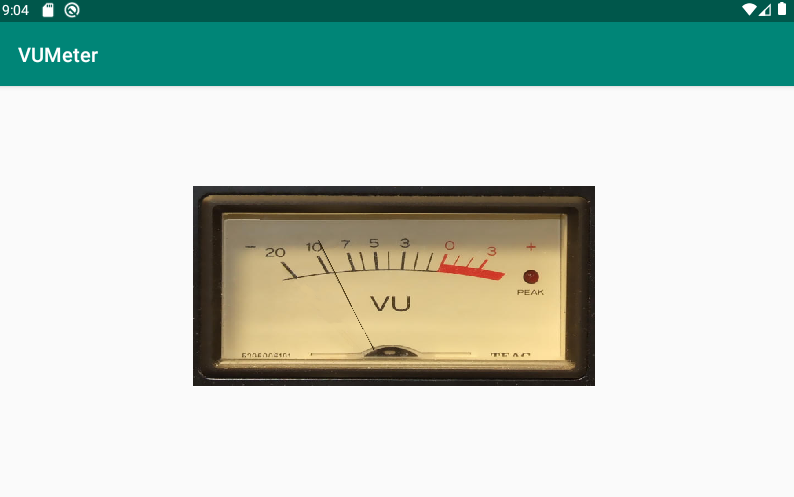

# Realistic VUMeterView for Android with OpenGL

# Install
Download the contents and open with AndroidStdio, then make.
It was tested with the following environment.

* Android Studio 3.5.1
* Min SDK Version 21
* OpenGLES 2.0
* Virtual device API29, Android 10.0, x86

If it does not work, check the App permission for Mic on the device.
Also, try chanding RECORDING_RATE in AudioReceiver.

# Description
This is a realistic VU meter implemented on GLSurfaceView, whose hand moves realistically
with a brief physics model based on periodical RMS input.

# Code
[main source file](src_bin/biconnected_embedding_finder.cpp)

* [VUMeterView](app/src/main/java/com/example/vumeter/VUMeterView.java): GLSurfaceView that displays the image on the screen. Not much in it other than interaction with Android View protocol and instantiation of the Renderer.

* [VUMeterRenderer](app/src/main/java/com/example/vumeter/VUMeterRenderer.java): OpenGL renderer. It uses GLES2.0

* [VUMeterModel](app/src/main/java/com/example/vumeter/VUMeterModel.java): The model geometry, the texture, and the shaders are handled here.

* [AudioReceiver](app/src/main/java/com/example/vumeter/AudioReceiver.java) : this instantiates AudioRecord, receives audio periodically, and calculates RMS, which is passed to VUMeterModel via [AudioReceiverListener](app/src/main/java/com/example/vumeter/AudioReceiverListener.java).

# Dependencies

The image of the VU meter is taken from the following in Wikipedia.
It is provided under Creative Commons BY 2.5.

>   https://en.wikipedia.org/wiki/VU_meter#/media/File:VU_Meter.jpg
>   Iainf 05:15, 12 August 2006 (UTC) - Own work CC BY 2.5

# Contact

For technical and commercial inquiries, please contact: Shoichiro Yamanishi

yamanishi72@gmail.com